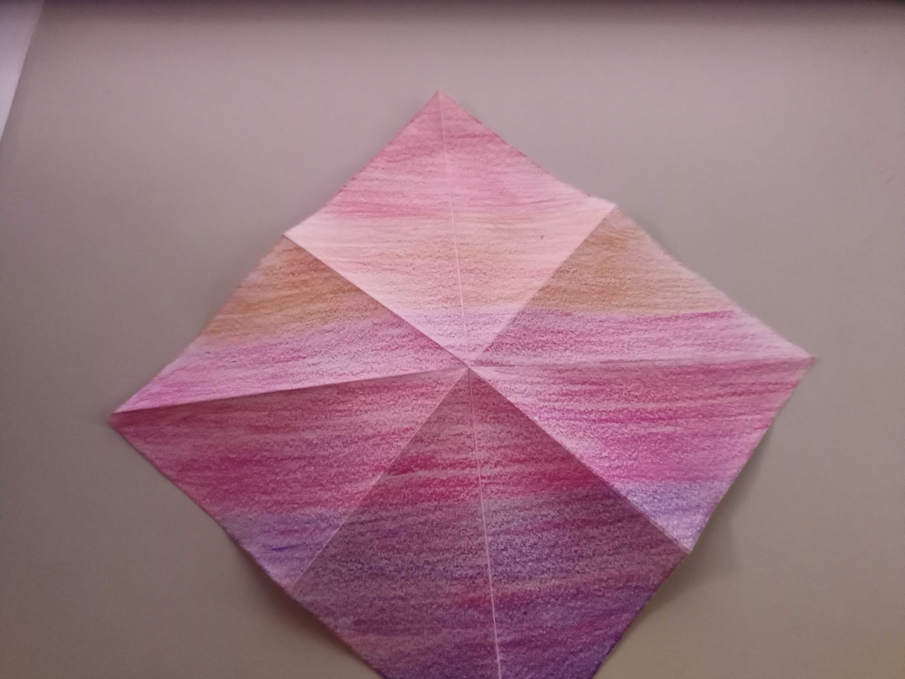
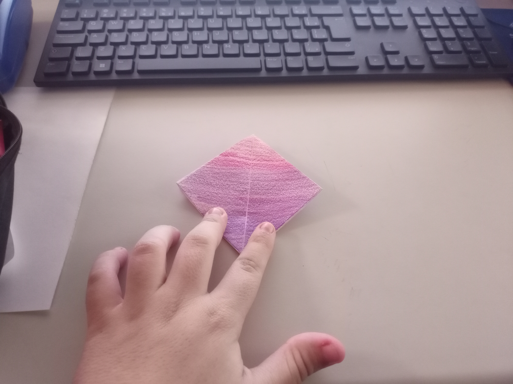
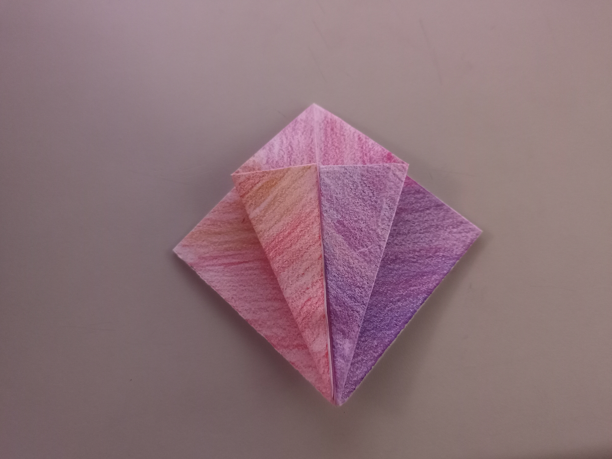
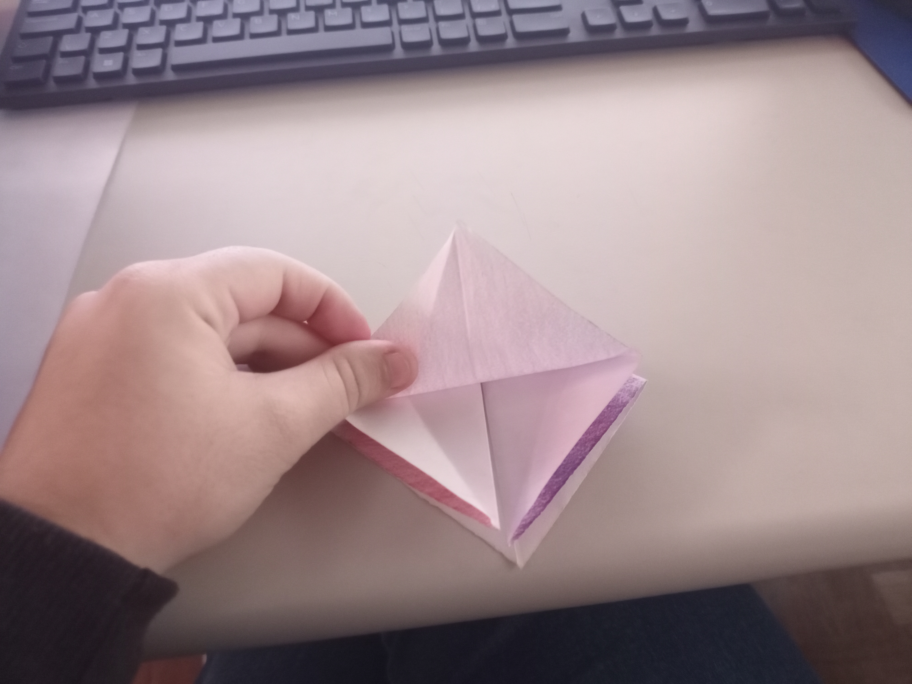
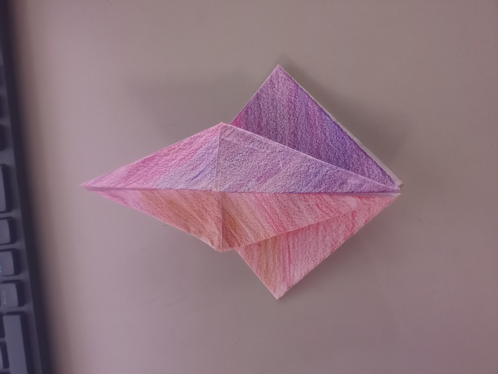
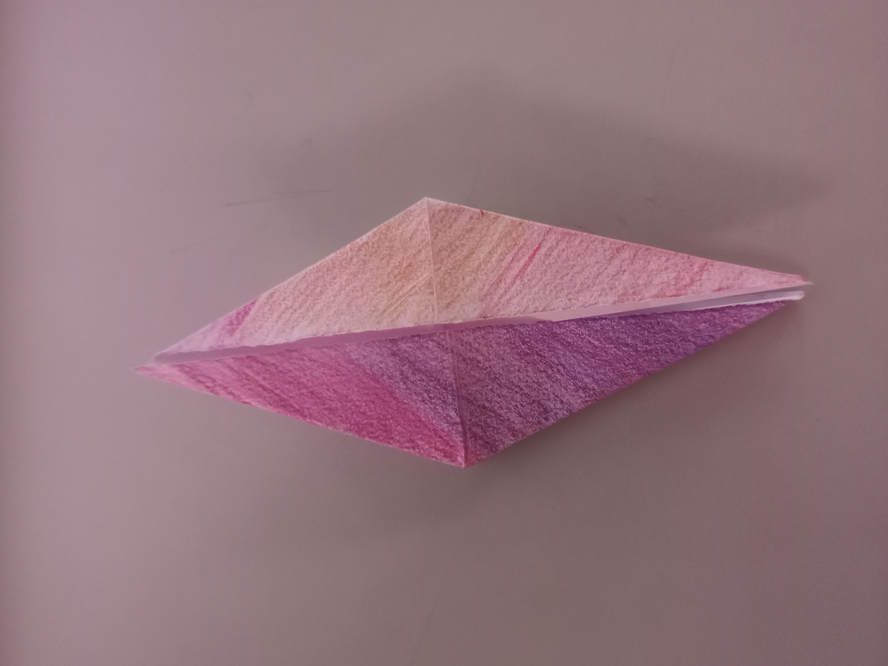
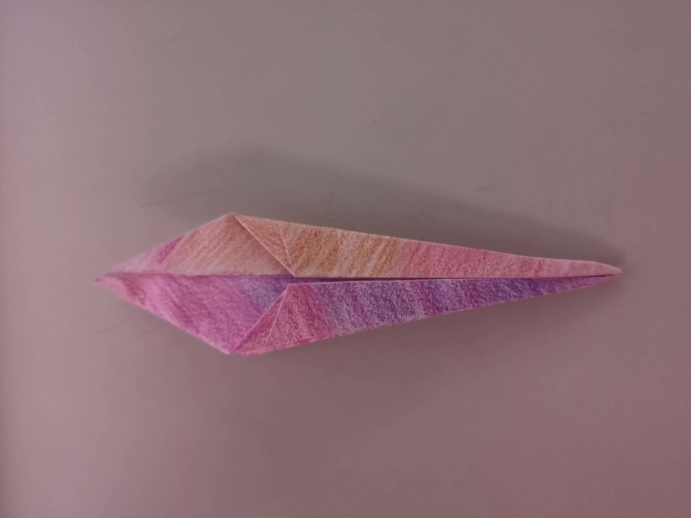
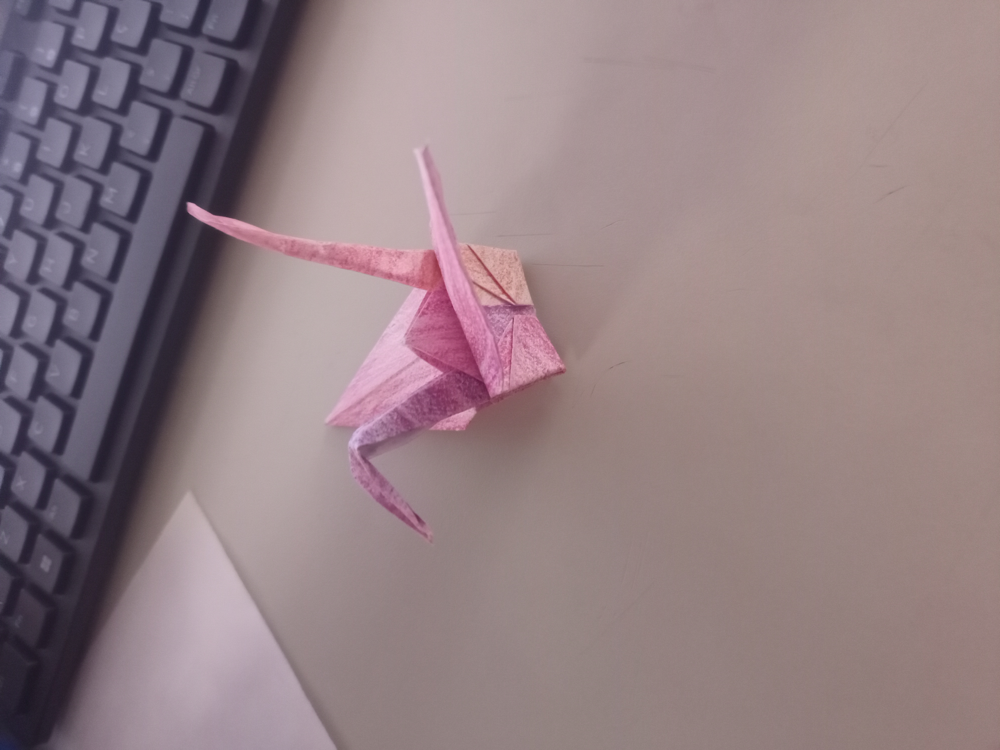

.# Giovanna_Passo_a_Passo_para_Montar_Tsuru

# Passo a passo para fazer um Tsuru:
### 1. Comece com o lado colorido para cima
Se seu papel tiver dois lados, deixe o colorido para cima.

### 2. Dobre o papel ao meio nas duas direções
Dobre horizontalmente e depois verticalmente.

Abra o papel após cada dobra.

Você terá uma cruz no papel.

### 3. Dobre nas diagonais
Dobre em triângulo (nas duas diagonais).

Abra novamente. Agora o papel terá um “X” e uma “+” nas dobras.

### 4. Forme uma base preliminar
Junte as laterais do quadrado para dentro, formando uma base em forma de diamante (chamada base preliminar ou base do balão).

Achate bem.

### 5. Faça a base do pássaro 
Com a ponta fechada voltada para baixo, dobre os dois lados para o centro formando um "papagaio".

Dobre a aba de cima para baixo para marcar e desdobre tudo.

Agora, levante a aba de baixo e dobre as laterais para dentro, acompanhando as marcas feitas.

Isso criará um formato alongado e pontudo. Vire e repita do outro lado.

### 6. Modele as asas
Dobre as abas superiores (as pontas longas) para cima — são as asas do tsuru.

As abas inferiores viram o pescoço e a cauda. Dobre uma para cima e depois dobre a ponta para formar a cabeça.

### 7. Finalize o Tsuru
Puxe levemente as asas para abri-lo.

